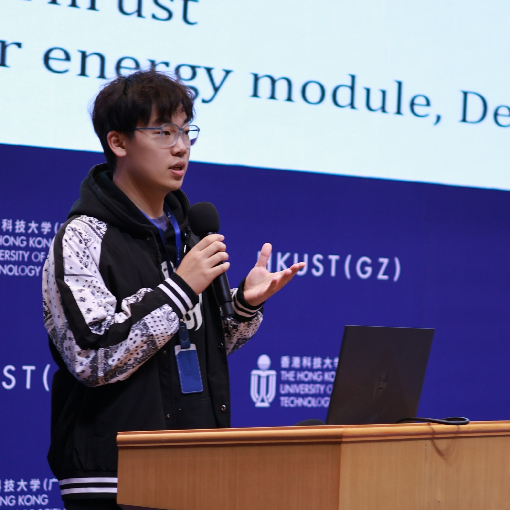

# About Me

Here is **Shuoren LI (李碩人)**.

I am a first-year MPhil student majoring in **Sustainable Energy and Environment (SEE)** at The Hong Kong University of Science and Technology (HKUST) Guangzhou Campus. I was receiving my BSc degree in June 2023 majoring in **Applied Chemistry** at Anhui Polytechnic University. I have also conducted visiting research under the supervision of [Prof. Hongyu CHEN](https://www.westlake.edu.cn/faculty/hongyu-chen.html) at Westlake University. Currently working on advanced photovoltaic materials for "solarfuel", advised by two academic supervisors, advised by [Prof. Chang YAN](https://ece.hkust.edu.hk/changyan) and [Prof. Teng ZHOU](https://cbe.hkust.edu.hk/people/teng-zhou). Here is [[my CV](file/CV_Shuoren%20LI.pdf)].

 

## Academic Background

- **Aug 2023 - Aug 2025 (Expected):** The Hong Kong University of Science and Technology (MPhil)
- **Sep 2019 - Jun 2023:** Anhui Polytechnic University (BSc)
- **Jun 2022 - Jul 2022:** Westlake University (Visiting Student)

 

---

## Research Interests

- Photoelectrochemical
- Photovoltaic Materials
- Nanoelectronics
- Localized Surface Plasmon Resonance

My current research focuses on photoelectrochemical solar energy conversion using advanced photovoltaic materials. The advantages of photoelectrochemical solar energy conversion are further exploited through more detailed research. I wish to devote my talent to this meaningful cause and bring well-being to society.

 

---

## News and Updates

- **Jan 2024：** Congratulations to Swan Saver Group for winning third prize in the 2024 Red Bird Maker Space Sustainable Smart Life Competition!
- **Jul 2023：** Happy to be awarded the Postgraduate Scholarship in HKUST (CNY 180,000 per year).
- **Jun 2023：** Happy to be awarded the Santos-UniSA Scholarship (AUD 27,500 per year).
- **Jun 2023：** Successfully obtained the Bachelor of Science degree and awarded the Outstanding Graduate of Anhui Province and Anhui Polytechnic University.
- **Apr 2023：** Congratulations our paper has been accepted by _**Inorganic Chemistry Frontiers**_! Click [here](https://pubs.rsc.org/en/content/articlelanding/2023/QI/D3QI00472D) to get this paper.
- **Feb 2023：** Congratulations the first author paper has been accepted by _**Applied Surface Science**_! Click [here](https://www.sciencedirect.com/science/article/pii/S0169433222029828?via%3Dihub) to get this paper.

If you are interested in my works, please feel free to contact me!
